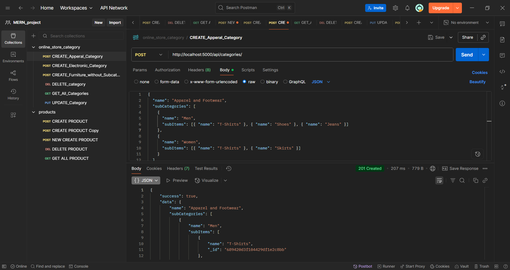
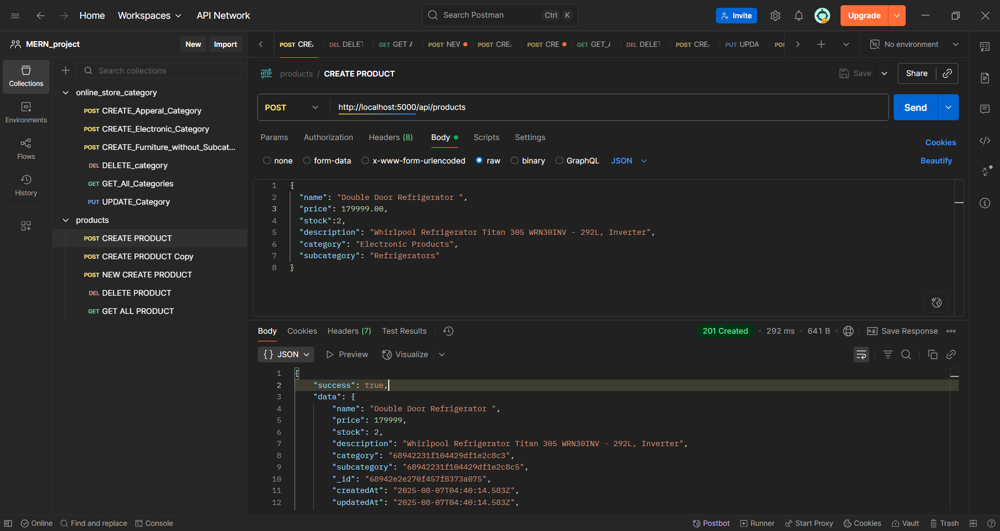
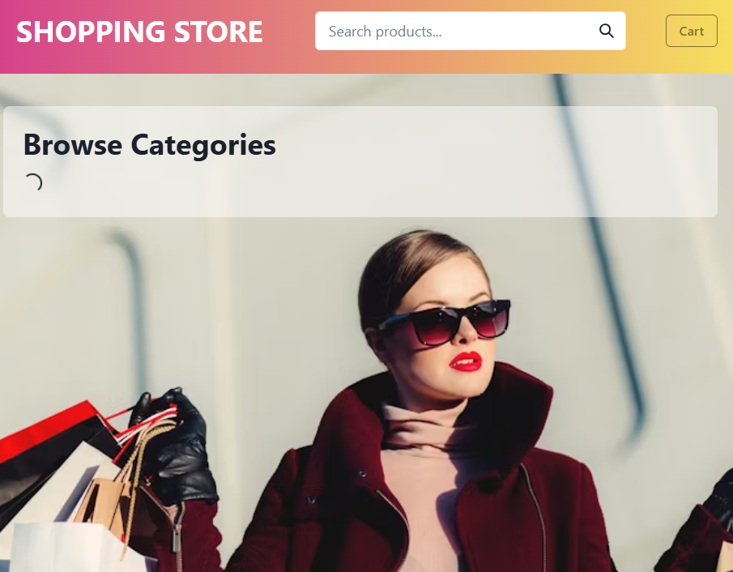
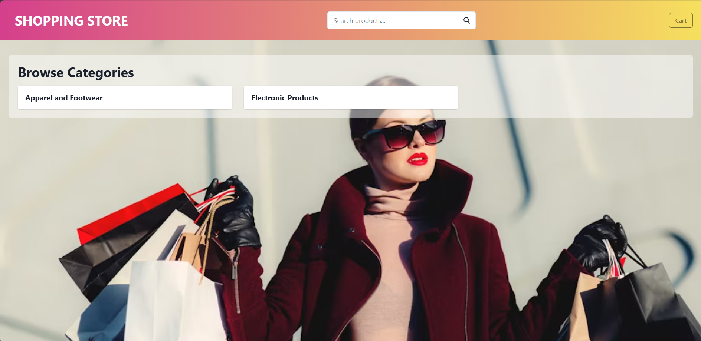
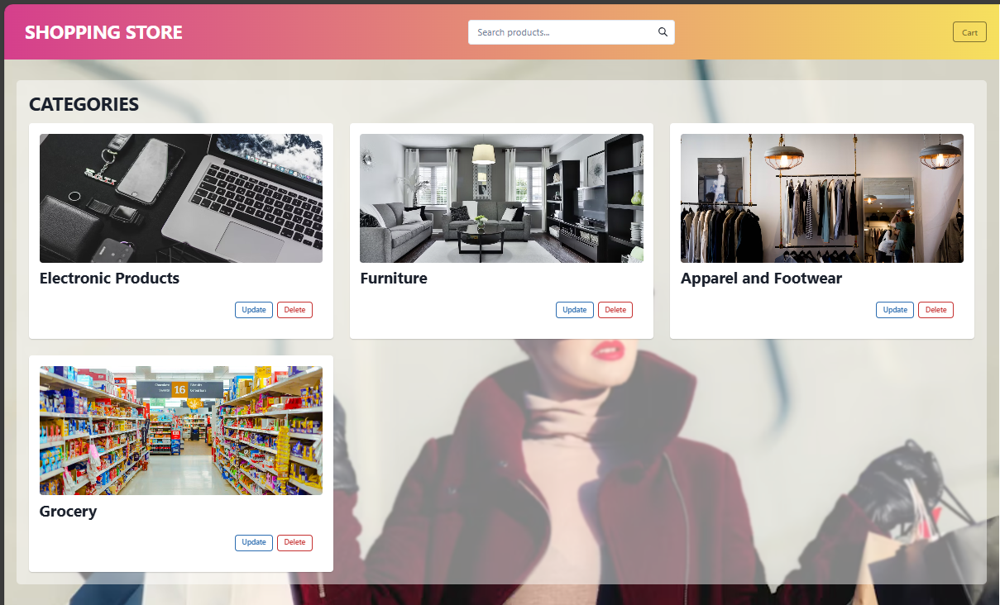
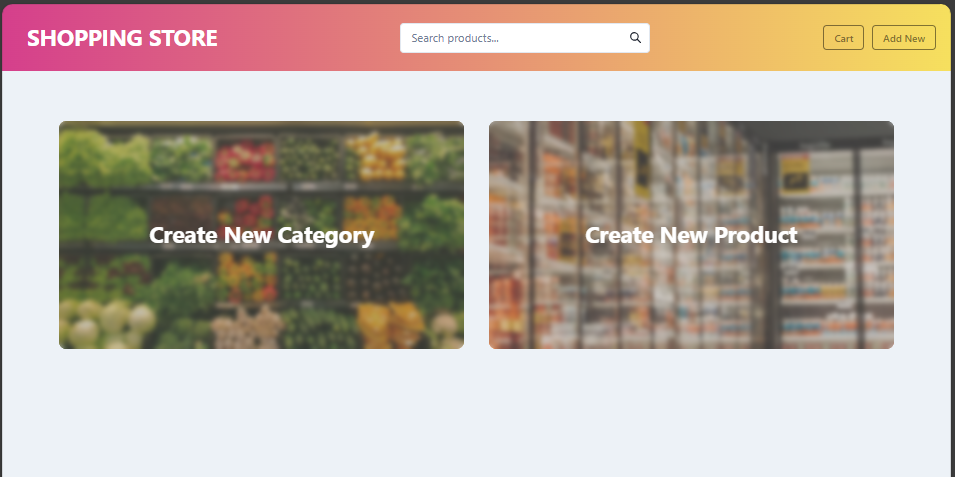
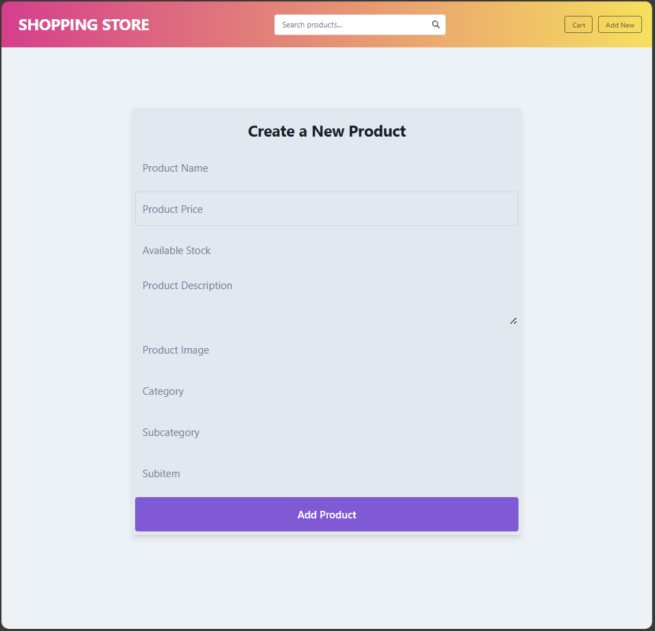
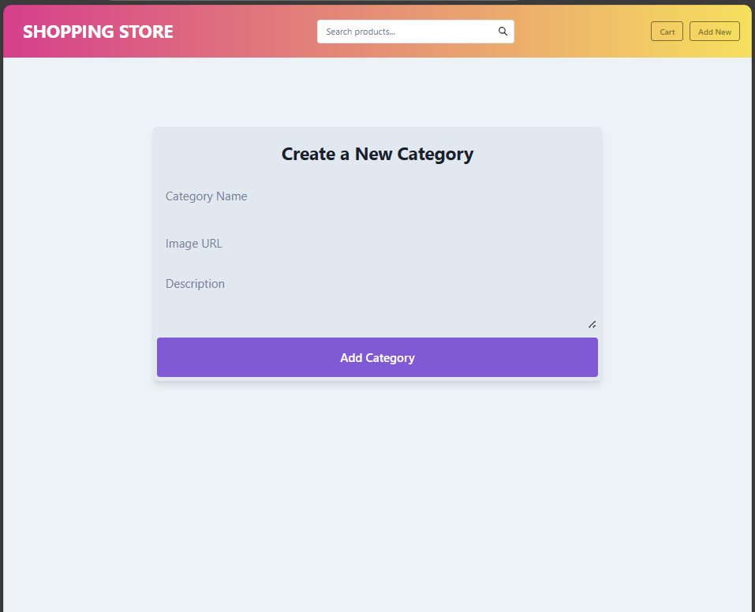

# 🛍️ MERN Online Shopping Store (Ongoing Project)

A full-featured online shopping web application built using the MERN stack (MongoDB, Express.js, React.js, Node.js).
This app allows users to browse products by category and subcategory, view detailed product information, and manage a shopping cart — with a fully functional backend and responsive frontend.

---

## 🚀 Features  
### Frontend  
- 📂 **Category & Subcategory Navigation** – Navigate from categories to subcategories and then to product listings.  
- 📱 **Responsive Design** – Works seamlessly on desktop and mobile devices.  
- 🛍 **Product Cards** – View product details including images, description, and price.  
- 🔍 **Dynamic Routing** – Category → Subcategory → Product flow.  

### Backend  
- 📦 **RESTful API** – Built with Express.js for products, categories, and subcategories.  
- 🗄 **MongoDB Database** – Stores product and category data.  
- 🔐 **Environment Variables** – Securely handle API keys, database URIs, etc.  
- 📜 **MVC Structure** – Clean separation of concerns with models, routes, and controllers.

---

## 🗂️ Tech Stack

| Layer       | Technology |
|-------------|------------|
| **Frontend** | React.js + Vite + Chakra UI |
| **Backend**  | Node.js + Express.js |
| **Database** | MongoDB Atlas |
| **Other**    | Mongoose, Axios, Dotenv, Git/Github |

---  

## ⚙️ Installation & Setup
### 1. Clone the repository
```sh 
git clone https://github.com/yourusername/mern-store.git
cd mern-store
```
### 2. Install dependencies
***Backend***
```sh
cd backend
npm install
```

***Frontend***
```sh
cd ../frontend
npm install
```

### 3. Setup environment variables  
Create a .env file inside the backend folder:
```sh
MONGO_URI=your_mongodb_connection_string
PORT=5000
```

### 4. Run the project
***Backend***
```sh
npm run dev
```

***Frontend***
```sh
cd ../frontend
npm start
```

## 📌 API Endpoints  

### **Category Routes** `/api/categories`
| Method | Endpoint             | Description                  |
|--------|----------------------|------------------------------|
| GET    | `/`                  | Get all categories           |
| GET    | `/:id`               | Get category by ID           |
| POST   | `/`                  | Create a new category        | 
| PUT    | `/:id`               | Update a category by ID      |
| DELETE | `/:id`               | Delete a category by ID      | 
---

### **Product Routes** `/api/products`
| Method | Endpoint             | Description                         | 
|--------|----------------------|-------------------------------------|
| GET    | `/`                  | Get all products                    |
| GET    | `/:id`               | Get product by ID                   | 
| POST   | `/`                  | Create a new product                | 
| PUT    | `/:id`               | Update a product by ID              | 
| DELETE | `/:id`               | Delete a product by ID              |
---

## Results (Up to now)
### 1. Checking APIs with Postman  
  
All functions in category controller✅  
  
  
  
All functions in product controller✅  
  
  

---

### 2. Home Page  

***Step 1***  
  

***Step 2***  
  

***Step 3***  
  

---

### 3. Create Page

  

---

***Create Product***

  

***Create Category***

  


